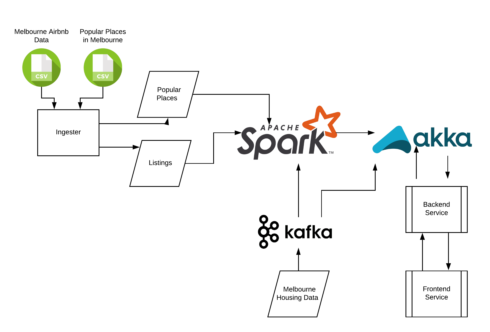
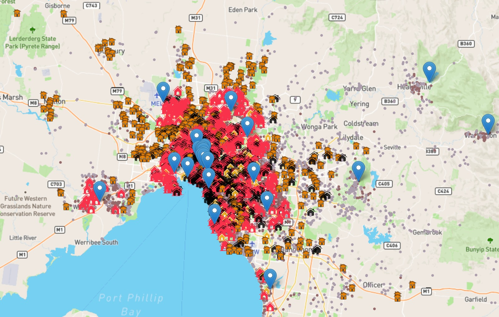
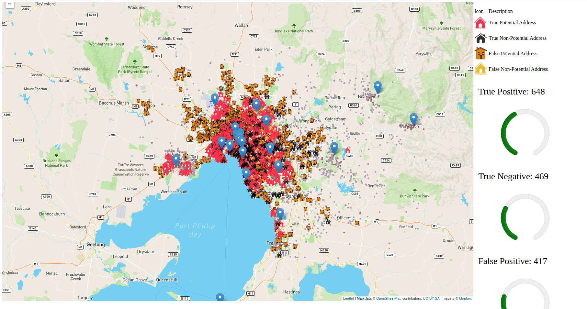

# Airbnb Property Acquisition Prediction 

## Introduction

Airbnb is well-known for world-class B&B accommdations all over the globe. In this project we try to predict the possible accommodations in an area that could potentially be a part of Airbnb thus increasing the profits. We do so by using the ML capablities of Spark and open-source data available on Kaggle. Our model is trained on features like:
1. Coordinates of the address. (Latitude, Longitude)
2. Number of rooms in the property.
3. Property price evaluation.
We choose Melbourne, AUS as the city to perform prediction for our project.

## Architecture
Following is the architecture:

Spark is responsible for training a Logistic Regression model on Airbnb dataset. Kafka creates a consumer-producer context in the application and allows us to convert a static csv to a streaming data pipeline for our project. 
Spark trained model is then applied on the streamed housing data to predict whether the incoming house-address is suitable for acquisiton or not.
This decision is appended to the house address and is sent to an Akka Actor who is responsible for sending this data to the frontend.

## Let's Start
To run the project you need to have kafka zookeeper installed in the system.

### Run Kafka, Zookeper and Producer
Navigate to the kafka directory and execute the following commands each in different terminal:
1. bin/zookeeper-server-start.sh config/zookeeper.properties
2. bin/kafka-server-start.sh config/server.properties
3. bin/kafka-topics.sh --create --bootstrap-server localhost:9092 --replication-factor 1 --partitions 1 --topic airbnb
4. bin/kafka-console-producer.sh --broker-list localhost:9092 --topic airbnb

### Run the project
Open up the project in any IDE which has good support for scala. We prefer Intellij Idea. Configure to run the project by providing command-line arguments:
    `melbourne_airbnb_one.csv popular_places.csv`

Run the configuration and access UI at http://localhost:63342/airbnb/src/main/ui/index.html

You should be able to see Markers denoting popular places in Melbourne and other dots indicating airbnb listings already present in the area. You could also see the grey markers denoting properties that our model thinks do not contribute much.

Now select any number of rows from resources/melbourne_housing.csv and paste them in the producer terminal that we started in the first step.
Switch back to UI and you should be able to view the houseAddresses and some metrics which are self-explanatory.

Here is a screenshot of the result:

Here is the zoomed in view of the results:

Following is the screenshot of the map with metrics:

Following is the Demo for the Entire Application:

